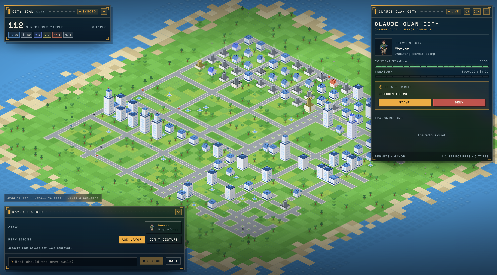
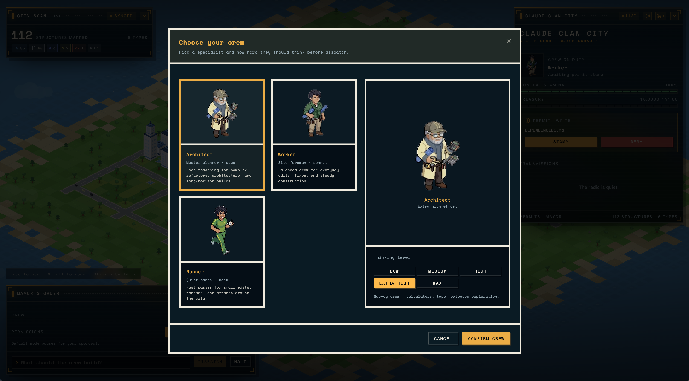
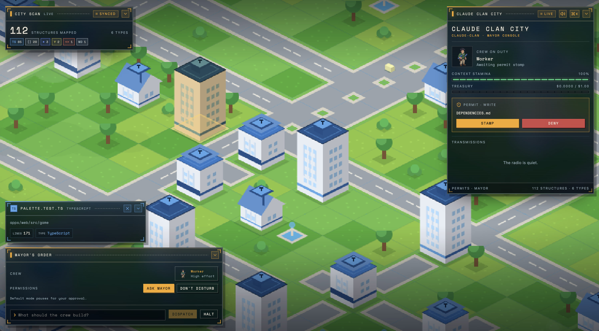

# Claude City

Turn a codebase into an isometric city, then run it as the mayor: type a
command, a Claude agent crew picks it up, and the city reacts live — cranes
rise over files being edited, buildings grow with the code, and a quest log
tracks what the crew is doing.

As agents take on more of the actual building, the bottleneck shifts from
writing code to keeping track of what an agent is doing — which files it's
touching, where the work is concentrating, when to step in. A terminal
transcript or a PR diff doesn't show that at a glance. Claude City turns the
repo into a spatial map instead, so watching a Claude agent build or review
code feels like watching a construction site, not scrolling a log.

- **Districts** are directories, sized by a treemap over lines of code.
- **Buildings** are files, colored by language.
- **Streets and traffic** are derived from import edges between files.
- **The crew** is one or more Claude Agent SDK sessions, driven by mayor
  commands typed in the HUD.



## In the city

The world fills the viewport and every panel is a floating HUD window you can
collapse; the layout is remembered between sessions.

- **Mayor's order** — type what the crew should build, then `DISPATCH` (or
  `HALT` to interrupt). Permissions are per order: `ASK MAYOR` pauses on every
  tool call for your approval, `DON'T DISTURB` lets the crew work unattended.
  Buildings can be dragged into the order as context paths.
- **Mayor console** — the crew on duty, a context stamina meter, the treasury
  against the session budget, permits waiting for a `STAMP` or `DENY`, and the
  transmissions log of the crew's transcript.
- **City scan** — how many structures are mapped, broken down by language.
- **Command palette** (`⌘K` / `Ctrl+K`) — fuzzy-search files; picking one flies
  the camera to its building.
- **Inspector** — click a building for the file behind it: path, line count and
  type.

While the crew works, construction sites raise cranes over the files being
edited and the crew sprite stands on site; the camera flies to the work.

### Choosing a crew

Pick a specialist and how hard they should think before dispatching. Each of the
three has its own portrait per thinking level.



| Crew | Model | Good for |
| --- | --- | --- |
| Architect | Opus | Complex refactors, architecture, long-horizon builds. |
| Worker | Sonnet | Everyday edits, fixes, steady construction. |
| Runner | Haiku | Small edits, renames, errands around the city. |

Thinking level runs `LOW` → `MEDIUM` → `HIGH` → `EXTRA HIGH` → `MAX`.

### Inspecting a building



### PR cities

Every open GitHub pull request (via `gh`) gets its own port city, `pr-<number>`,
alongside `main`. Ship travel takes you between them:

- Each PR city is a lazily-built `git worktree` at the PR's head — checked out
  and scanned only the first time you sail there.
- Changed files render as a diff overlay on top of the map: new buildings for
  additions, highlighted plots for edits, ghost plots for deletions.
- The crew dispatched in a PR city is read-only — `Write`, `Edit`, and
  `NotebookEdit` are disabled at the tool level, not just gated behind a
  permit — so it can read and search the diff but never patch it in place.
- To publish a verdict it runs `gh pr review --approve|--request-changes|--comment`
  through `Bash`, which still raises a mayor permit before it executes —
  nothing ships without a `STAMP`.

## How it works

| Package | Responsibility |
| --- | --- |
| `packages/worldgen` | Scans a repository (files, imports, external deps, git churn) into a `WorldMap`. |
| `packages/layout` | Turns a `WorldMap` into a laid-out `WorldSnapshot` (treemap districts, plots, streets). |
| `packages/world` | Persists world state to SQLite (`.sudocity/world.db` in the target repo). |
| `packages/agent` | Wraps `@anthropic-ai/claude-agent-sdk` sessions and turns SDK messages into `GameEvent`s. |
| `packages/cities` | Lists open PRs and manages the `git worktree` + diff overlay behind each PR city. |
| `packages/protocol` | Shared zod schemas/types for world state, game events, and mayor commands. |
| `apps/server` | Fastify + WebSocket server: scans the repo, serves world snapshots per city, relays mayor commands to the agent, streams events. |
| `apps/web` | Vite + React + Phaser client: renders the isometric city and the mayor HUD (chat, quest log, HUD stats). |
| `apps/cli` | `sudo-city <path>` — boots the server and web app together against a target repository and opens the browser. |

## Requirements

- Node.js >= 22.5.0
- pnpm 11.10.0 (see `packageManager` in `package.json`)
- Claude access: either `ANTHROPIC_API_KEY` in your environment (or a `.env`
  file in the repository you point sudo-city at) or an existing local Claude
  Code login, which the agent falls back to.
- [`gh`](https://cli.github.com) authenticated against the target repo, for PR
  cities (listing open PRs and posting reviews). Optional if you're only
  visiting `main`.

## Getting started

```bash
pnpm install

# run the server + web app against the current repo
pnpm dev

# or point it at any repository via the CLI
pnpm --filter @sudo-city/cli start -- ../some-other-repo
```

The web app defaults to `http://127.0.0.1:5173` and connects to the server's
WebSocket at `ws://127.0.0.1:4100/ws` (override with `VITE_WS_URL`).

| Env var | Default | What it does |
| --- | --- | --- |
| `HOST` / `PORT` | `127.0.0.1` / `4100` | Server bind address. |
| `SUDO_CITY_REPO` | current working directory | Repository to turn into the demo city. |
| `SUDO_CITY_MAX_BUDGET_USD` | `1` | Spend ceiling shared across every open city/workspace. |
| `SUDO_CITY_CLONE_ROOT` | `<tmpdir>/sudocity` | Where per-user repo clones are cached. |
| `ANTHROPIC_API_KEY` | — | Falls back to a local Claude Code login if unset. |
| `VITE_WS_URL` | `ws://127.0.0.1:4100/ws` | WebSocket the web app connects to. |
| `VITE_API_URL` | `http://127.0.0.1:4100` | REST base URL for login/repos. |

World state is persisted to `.sudocity/world.db` inside each repo's working
copy (the demo checkout, or a per-user clone under `SUDO_CITY_CLONE_ROOT`).

## GitHub login

Visiting the site with no sign-in shows a **SEE THE DEMO CITY** button that
renders Claude City's own repo. Signing in with **LOGIN WITH GITHUB** lets a
visitor import their own repositories and see them rendered as a city too.

## Development

```bash
pnpm build       # build all workspace packages/apps
pnpm typecheck   # typecheck all workspace packages/apps
pnpm test        # run vitest in every package that has tests
```

Each package/app also exposes its own `build`, `dev`, `test`, and
`typecheck` scripts if you want to run one in isolation, e.g.
`pnpm --filter @sudo-city/web test`.

## Project layout

```
apps/
  cli/      sudo-city CLI: boots server + web, opens the browser
  server/   Fastify/WebSocket server: scan, snapshot, agent relay
  web/      Vite/React/Phaser isometric city client
packages/
  agent/    Claude Agent SDK session wrapper
  cities/   PR listing, git worktrees, and diff overlays for PR cities
  layout/   Treemap/plot layout for the world map
  protocol/ Shared zod schemas and types
  world/    SQLite-backed world state persistence
  worldgen/ Repository scanner (files, imports, deps, churn)
fixtures/
  repos/    Sample repositories used for local testing
```
